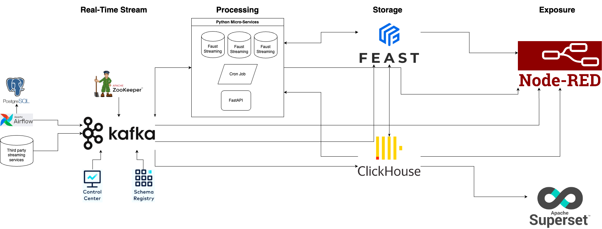

# End-to-End Data Engineering System for Real-Time Data in AI Systems
## Table of Contents
1. Introduction
3. System Architecture
2. Getting Started
4. Data Pipeline Details
6. Additional Use Case Scenarios
7. Advanced Topics
8. Contributing
9. License


## 1. Introduction
### Project Overview
This project demonstrates an end-to-end data engineering system designed to handle real-time data specifically tailored for AI systems. By leveraging a comprehensive set of tools and technologies, the system showcases how to effectively process, store, and analyze streaming data in real-time. The architecture is flexible and can be adapted to various domains beyond the provided use case of an online iGaming casino, such as e-commerce, finance, and more.

### Use Case: Online iGaming Casino
In this example, the system simulates an online iGaming casino environment where various gaming activities generate a continuous stream of data. This data includes customer interactions, game activities, bets placed, and winnings. The goals of the system are:

- To capture and process this data in real-time.
- To perform real-time analytics and generate insights.
- To store processed data for historical analysis and reporting.
- To facilitate AI/ML model integration for predictive analytics and personalized gaming experiences.


This project aims to illustrate a robust, scalable, and efficient data engineering system capable of handling the demands of real-time data processing and analysis, providing a solid foundation for building intelligent AI systems.

## 2. System Architecture
The system architecture consists of multiple interconnected components that work together to achieve real-time data processing and analytics. Below is a high-level diagram of the architecture:




### Key Components:

### [Apache Airflow](https://airflow.apache.org/)
**Apache Airflow** is a platform used to programmatically author, schedule, and monitor workflows. In this project, Airflow is responsible for orchestrating the entire data pipeline, scheduling tasks, and managing dependencies. It includes a script (`casino_stream.py`) that mimics real-time streaming data from an online casino.

### Real-Time Data Streaming
- **[Apache Kafka](https://kafka.apache.org/)** is a distributed event streaming platform capable of handling high throughput and low latency data streams. It serves as the backbone for real-time data streaming in this architecture. 
- **[Zookeeper](https://zookeeper.apache.org/)** is used to manage and coordinate the distributed Kafka cluster.
- **[Control Center](https://docs.confluent.io/platform/current/control-center/index.html)** is a management and monitoring tool for Kafka. It helps in monitoring Kafka clusters and managing Kafka topics and consumer groups. 
- **[Schema Registry](https://docs.confluent.io/platform/current/schema-registry/index.html)** is used to manage and enforce schemas for Kafka data streams, ensuring data consistency and compatibility across different components.

### Python Micro-services Apps
Python micro-services are used for various tasks within the workflow. The architecture includes three types of micro-services:
- **Streaming**: Implemented using [Faust](https://github.com/faust-streaming/faust), a stream processing library for Python.
- **Cron Jobs**: Time-based tasks are handled by cron jobs. For example, the `stream_data` function in `casino_stream.py` is triggered by a cron job every 5 seconds.
- **REST-API**: Implemented using [FastAPI](https://fastapi.tiangolo.com/), a modern web framework for building APIs with Python 3.6+.

### [ClickHouse](https://clickhouse.com/)
**ClickHouse** is a fast open-source columnar database management system that allows generating analytical data reports in real-time using SQL queries. It stores the raw data ingested from Kafka and provides real-time analytics through various schemas and materialized views.

### [Grafana](https://grafana.com/)
**Grafana** is an open-source platform for monitoring and observability. It provides log tracing and monitoring dashboards, allowing users to visualize and analyze metrics from various data sources.

### [Apache Superset](https://superset.apache.org/)
**Apache Superset** is an open-source data exploration and visualization platform. It enables users to create interactive dashboards and perform data analysis through a web interface, integrating seamlessly with ClickHouse.

### [Node-RED](https://nodered.org/)
**Node-RED** is a flow-based development tool for visual programming. It provides a no-code solution for orchestrating complex workflows and integrating various components within the system.

### [Feast (Feature Store)](https://feast.dev/)
**Feast** is an open-source feature store for managing and serving machine learning features. It ensures consistency between offline and online features, facilitating the integration of AI/ML models for predictive analytics and personalized experiences.


## 3. Getting Started

### Prerequisites
Before you begin, ensure you have the following installed on your local machine:
- **Docker**: Docker is required to run the containerized services. Download and install Docker from [here](https://www.docker.com/get-started).
- **Docker Compose**: Docker Compose is used to manage multi-container Docker applications. It is included with Docker Desktop, or you can install it separately from [here](https://docs.docker.com/compose/install/).

### Installation
Follow these steps to set up the environment:

1. **Clone the Repository**:
    ```bash
    git clone https://github.com/zerafachris/ai_data_platform.git
    cd ai_data_platform
    ```

4. **Download Required Docker Images**:
    The `docker-compose` command will automatically pull the required images, but you can also pre-pull them to save time:
    ```bash
    docker-compose pull
    ```

### Configuration
Edit the following files to match your configuration requirements:

1. **Airflow Entrypoint Script (`airflow/script/entrypoint.sh`)**:
    Ensure the script has the necessary permissions:
    ```bash
    chmod +x airflow/script/entrypoint.sh
    ```

2. **Airflow DAGs (`airflow/dags`)**:
    Place your DAG files in the `airflow/dags` directory. For this project, ensure `casino_stream.py` is included.

3. **ClickHouse Configuration**:
    - `clickhouse/users.d/users.xml`: User configuration for ClickHouse.
    - `clickhouse/config.d/config.xml`: General configuration for ClickHouse.
    - `clickhouse/docker-entrypoint-initdb.d/`: Initialization scripts for ClickHouse.

4. **Grafana**:
    - Ensure your Grafana configuration and provisioning files are placed in the `grafana` directory.

5. **Superset**:
    - Customize the Dockerfile (`superset/superset.Dockerfile`) if necessary.
    - Place any additional configuration files in the `superset` directory.

6. **Node-RED**:
    - Customize the Dockerfile (`nodered/nodered.Dockerfile`) if necessary.
    - Place any additional configuration files in the `nodered` directory.

### Running the System
Start the entire system using Docker Compose:
1. **Start the Services**:
    ```bash
    docker-compose up -d
    ```

2. **Verify Service Status**:
    Ensure all services are running properly by checking the Docker logs:
    ```bash
    docker-compose logs -f
    ```

3. **Accessing the Services**:
    - **Airflow Webserver**: http://localhost:8080
    - **Kafka Control Center**: http://localhost:9021
    - **Schema Registry**: http://localhost:8081
    - **PostgreSQL**: Port 5432 (access via your preferred SQL client)
    - **ClickHouse**: http://localhost:8123
    - **Grafana**: http://localhost:3000
    - **Superset**: http://localhost:8088
    - **Node-RED**: http://localhost:1880

4. **Stopping the Services**:
    To stop the running services, use:
    ```bash
    docker-compose down
    ```

5. **Restarting the Services**:
    To restart the services, use:
    ```bash
    docker-compose up -d
    ```


## 4. Data Pipeline Details

The data pipeline is the core of this real-time data engineering system, designed to handle streaming data efficiently from ingestion to processing, storage, and analysis. This section outlines the flow of data through the various stages of the pipeline.

### Data Generation and Ingestion
The data pipeline begins with the generation of data that simulates real-time activities in an online iGaming casino. 

- **Data Generation (Apache Airflow)**:
    - The script `casino_stream.py` generates a continuous stream of data representing customer interactions, game activities, bets placed, and winnings.
    - This data is structured with the following schema:
    ```python
    casino_data = {
        'customer_id': customer_id,
        'activity_datetime': activity_datetime,
        'game_activity': game_activity,
        'game_id': game_id,
        'game_type': game_type,
        'bet_amount': bet_amount,
        'win_amount': win_amount,
        'bonus_amount': bonus_cost_amount
    }
    ```
    - Airflow schedules and manages the execution of this script using DAGs, ensuring a continuous data flow.

- **Data Ingestion (Apache Kafka)**:
    - The generated data is ingested into Kafka, a high-throughput distributed messaging system.
    - Kafka topics are used to organize and categorize the streaming data, ensuring efficient data flow and scalability.
    - Zookeeper manages the Kafka cluster, maintaining configuration information and synchronizing distributed processes.

### Data Processing
Once the data is ingested into Kafka, it needs to be processed and transformed for further analysis.

- **Streaming Data Processing (Faust)**:
    - Faust, a Python stream processing library, processes the real-time data streams from Kafka.
    - It performs transformations, aggregations, and filtering on the data as it flows through the pipeline.
    - The processed data is then published back to Kafka or forwarded to other components for further processing.

- **Batch Processing (Cron Jobs)**:
    - Some data processing tasks are scheduled to run at specific intervals using cron jobs.
    - For example, the `stream_data` function in `casino_stream.py` is triggered by a cron job every 5 seconds to simulate continuous data generation.
    - These cron jobs are managed by Airflow, ensuring timely execution of batch tasks.

### Data Storage
After processing, the data needs to be stored in a way that allows for efficient querying and analysis.

- **ClickHouse**:
    - ClickHouse is used to store the processed data in a columnar format, optimized for analytical queries.
    - It provides real-time data ingestion capabilities from Kafka, ensuring low-latency access to the latest data.
    - Different schemas and materialized views are created in ClickHouse to support various analytical queries and reporting requirements.

### Data Analysis and Visualization
The final stage of the data pipeline involves analyzing and visualizing the data to derive insights and support decision-making.

- **Grafana**:
    - Grafana is used for monitoring and visualizing system metrics and logs.
    - It provides dashboards that help track the performance and health of the data pipeline components.
    - Users can create custom dashboards to visualize specific metrics and gain real-time insights.

- **Apache Superset**:
    - Superset is used for data exploration and creating interactive dashboards.
    - It connects to ClickHouse to run analytical queries and visualize the results.
    - Users can create charts, graphs, and dashboards to explore the data and generate reports.

### Machine Learning Feature Store
To facilitate AI/ML model integration, the system includes a feature store for managing machine learning features.

- **Feast**:
    - Feast is a feature store that provides a centralized repository for storing and serving machine learning features.
    - It ensures consistency between offline training data and online inference data.
    - Features are ingested from the processed data and made available for AI/ML models to use in real-time predictions and personalized recommendations.

### Workflow Orchestration and Integration
- **Node-RED**:
    - Node-RED provides a visual interface for orchestrating and integrating different components of the data pipeline.
    - It allows users to create complex workflows using a drag-and-drop interface, enabling seamless integration between various services.
    - Node-RED can be used to trigger specific actions based on events or conditions, enhancing the flexibility of the data pipeline.

This detailed overview of the data pipeline illustrates how data flows through the system, from generation and ingestion to processing, storage, analysis, and machine learning integration. Each component plays a crucial role in ensuring the pipeline operates efficiently and effectively, providing real-time insights and supporting intelligent AI systems.

## 5. Monitoring and Maintenance

Effective monitoring and maintenance are critical to ensure the reliability, performance, and scalability of the data engineering system. This section outlines the tools and strategies used to monitor and maintain the system, as well as best practices for ongoing management.

### Monitoring Tools

#### Grafana
**Grafana** is a powerful open-source tool used for monitoring and observability. It provides a visual interface for creating and viewing dashboards, which can include real-time metrics from various data sources.

- **Metrics Collection**:
  - Grafana collects metrics from the system components, such as Kafka, ClickHouse, Airflow, and more.
  - These metrics can include CPU usage, memory consumption, network traffic, latency, error rates, and other performance indicators.
- **Dashboards**:
  - Custom dashboards can be created to visualize key metrics and monitor the health and performance of the system.
  - Dashboards can be configured to send alerts and notifications based on specific thresholds or conditions.
- **Log Tracing**:
  - Grafana integrates with log management tools to provide log tracing capabilities.
  - This helps in diagnosing issues by correlating logs with performance metrics and identifying the root cause of problems.

#### Control Center
**Control Center** is a management and monitoring tool for Kafka. It provides a comprehensive view of Kafka clusters, making it easier to manage and monitor Kafka brokers, topics, and consumer groups.

- **Cluster Management**:
  - Control Center allows you to manage Kafka clusters, including creating, deleting, and configuring topics and partitions.
  - It provides visibility into the cluster's health, status, and performance.
- **Monitoring Kafka Streams**:
  - Control Center tracks the performance of Kafka streams, including throughput, latency, and lag.
  - It helps in identifying bottlenecks and ensuring that data flows smoothly through the Kafka pipeline.
- **Schema Management**:
  - With the integrated Schema Registry, Control Center ensures that data schemas are managed and enforced consistently.
  - It helps in maintaining data compatibility and avoiding schema-related issues.

### Maintenance Strategies

#### Regular Backups
Regular backups are essential to protect against data loss and ensure business continuity. The following components should be backed up regularly:

- **Airflow Metadata Database**:
  - The PostgreSQL database used by Airflow to store metadata, such as DAG definitions, task instances, and logs.
- **ClickHouse Database**:
  - The ClickHouse database storing processed and raw data for analytical queries.
- **Kafka Topics**:
  - Kafka topics containing streaming data should be backed up to prevent data loss in case of a failure.

#### System Updates
Keeping the system components up-to-date is crucial for security, performance, and compatibility. Regularly check for updates and apply patches to the following:

- **Docker Images**:
  - Ensure that all Docker images used in the system are updated to the latest versions.
- **Python Libraries**:
  - Keep the Python libraries used in the micro-services and Airflow scripts updated to their latest versions.

#### Performance Tuning
Performance tuning helps in optimizing the system for better efficiency and scalability. Consider the following areas for tuning:

- **Kafka Configuration**:
  - Tune Kafka configurations, such as replication factors, partitions, and retention policies, to optimize performance.
- **ClickHouse Queries**:
  - Optimize ClickHouse queries and schemas to improve query performance and reduce latency.
- **Resource Allocation**:
  - Monitor and adjust resource allocation for containers, such as CPU and memory limits, to ensure optimal performance.

#### Monitoring Alerts
Setting up monitoring alerts is essential for proactive maintenance and timely issue resolution. Use the following strategies:

- **Threshold Alerts**:
  - Configure threshold-based alerts in Grafana to notify you when specific metrics exceed defined limits.
- **Anomaly Detection**:
  - Implement anomaly detection to identify unusual patterns or behaviors in the system metrics.
- **Incident Response**:
  - Develop an incident response plan to address and resolve issues quickly when alerts are triggered.

### Best Practices for Ongoing Management

- **Documentation**:
  - Maintain comprehensive documentation for the system architecture, components, configurations, and procedures.
  - Ensure that documentation is kept up-to-date with any changes or updates.
- **Regular Audits**:
  - Conduct regular audits of the system to identify potential issues, security vulnerabilities, and areas for improvement.
- **Capacity Planning**:
  - Plan for future capacity needs by monitoring usage trends and scaling the system components accordingly.
- **Training and Knowledge Sharing**:
  - Ensure that team members are trained on the system components, monitoring tools, and maintenance procedures.
  - Encourage knowledge sharing and collaboration within the team to foster continuous improvement.

By following these monitoring and maintenance strategies, you can ensure that the data engineering system remains reliable, performant, and scalable, providing a solid foundation for real-time data processing and analytics.

## 6. Use Case Scenarios

The versatility of this end-to-end data engineering system allows it to be adapted to a variety of use case scenarios beyond the primary example of an online iGaming casino. This section explores different scenarios in which this system can be applied, highlighting the flexibility and scalability of the architecture.

### 6.1 Online iGaming Casino

#### Real-Time Player Behavior Analysis
- **Objective**: Monitor and analyze player behavior in real-time to detect patterns, preferences, and potential issues.
- **Implementation**:
  - Ingest real-time player activity data (e.g., game plays, bets, wins) into Kafka.
  - Use Faust to process the streaming data, calculating metrics like average bet size, win rates, and session duration.
  - Store processed data in ClickHouse and visualize trends in Grafana and Superset.
  - Utilize Feast to manage features for predictive models that identify high-value players or detect fraudulent behavior.

#### Personalized Game Recommendations
- **Objective**: Provide personalized game recommendations to players based on their historical and real-time activity.
- **Implementation**:
  - Collect historical and real-time data on player preferences and activities.
  - Use Python micro-services and FastAPI to build and serve a recommendation engine.
  - Implement machine learning models that generate recommendations based on features stored in Feast.
  - Update recommendations in real-time as new data arrives, enhancing the player experience.

### 6.2 E-Commerce

#### Real-Time Inventory Management
- **Objective**: Monitor inventory levels in real-time and automatically trigger restocking or reordering processes.
- **Implementation**:
  - Stream sales and inventory data into Kafka from various sources (e.g., point-of-sale systems, online orders).
  - Process data with Faust to calculate current stock levels, sales velocity, and reorder points.
  - Store and analyze inventory data in ClickHouse, and create dashboards in Grafana for visibility.
  - Set up alerts and automated workflows in Node-RED to initiate restocking when inventory drops below a threshold.

#### Customer Purchase Behavior Analysis
- **Objective**: Understand and predict customer purchase behavior to optimize marketing strategies and product offerings.
- **Implementation**:
  - Ingest customer purchase data from multiple channels (e.g., online, in-store) into Kafka.
  - Use Airflow to orchestrate batch processing jobs that aggregate and analyze purchase data.
  - Apply machine learning models to predict future purchases and identify high-value customers, with features managed by Feast.
  - Visualize purchase patterns and predictive insights in Superset and Grafana.

### 6.3 Finance

#### Real-Time Fraud Detection
- **Objective**: Detect and prevent fraudulent transactions in real-time to minimize financial losses.
- **Implementation**:
  - Stream transaction data from banking systems into Kafka for real-time processing.
  - Utilize Faust to apply rules and machine learning models for fraud detection on streaming data.
  - Store flagged transactions and analysis results in ClickHouse for further investigation.
  - Create real-time alerts and monitoring dashboards in Grafana to notify security teams of suspicious activities.

#### Market Trend Analysis
- **Objective**: Analyze financial market trends in real-time to inform trading strategies and investment decisions.
- **Implementation**:
  - Collect real-time market data (e.g., stock prices, trading volumes) from external APIs and ingest into Kafka.
  - Process and aggregate market data using Faust and batch processing jobs orchestrated by Airflow.
  - Store historical and real-time market data in ClickHouse, enabling fast analytical queries.
  - Build visualizations in Superset to track market trends, identify opportunities, and make data-driven decisions.

### 6.4 Healthcare

#### Patient Monitoring and Alerting
- **Objective**: Continuously monitor patient vital signs and health metrics to provide timely alerts and interventions.
- **Implementation**:
  - Stream patient data (e.g., heart rate, blood pressure) from medical devices into Kafka.
  - Use Faust to process and analyze the data in real-time, applying rules to detect anomalies.
  - Store patient data and alerts in ClickHouse, ensuring secure and scalable storage.
  - Visualize patient metrics in Grafana, and set up alerting mechanisms to notify healthcare providers of critical conditions.

#### Personalized Treatment Plans
- **Objective**: Develop personalized treatment plans based on patient data and predictive analytics.
- **Implementation**:
  - Collect and integrate data from various sources, including electronic health records (EHRs) and real-time monitoring devices.
  - Use Python micro-services to build predictive models that recommend treatment plans based on patient features managed by Feast.
  - Update treatment recommendations in real-time as new data is ingested and processed.
  - Create dashboards in Superset to visualize patient progress and treatment outcomes, enabling healthcare providers to make informed decisions.

### 6.5 Smart Cities

#### Traffic Monitoring and Management
- **Objective**: Monitor and manage city traffic in real-time to optimize flow and reduce congestion.
- **Implementation**:
  - Ingest data from traffic sensors, cameras, and connected vehicles into Kafka.
  - Process and analyze traffic data in real-time using Faust, identifying congestion patterns and incidents.
  - Store traffic data in ClickHouse and create dashboards in Grafana for traffic monitoring.
  - Use Node-RED to orchestrate responses, such as adjusting traffic light timings or sending alerts to drivers.

#### Environmental Monitoring
- **Objective**: Monitor environmental conditions (e.g., air quality, noise levels) in real-time to ensure public safety and compliance.
- **Implementation**:
  - Stream data from environmental sensors into Kafka.
  - Use Faust to process and analyze the data, detecting pollution levels and trends.
  - Store environmental data in ClickHouse and visualize it in Grafana and Superset.
  - Set up alerts in Grafana to notify authorities of hazardous conditions, enabling timely interventions.

These use case scenarios demonstrate the flexibility and adaptability of the end-to-end data engineering system. By leveraging the powerful tools and technologies in this architecture, organizations across various industries can achieve real-time data processing, analytics, and actionable insights.

## 7. Advanced Topics

This section delves into advanced topics that can enhance the functionality, scalability, and robustness of the end-to-end data engineering system. These topics cover areas such as scalability, security, machine learning integration, and real-time analytics, providing deeper insights into optimizing and extending the system.

### 7.1 Scalability and Performance Optimization

#### Kafka Partitioning and Replication
- **Partitioning**: Distribute data across multiple Kafka partitions to parallelize processing and improve throughput.
  - Strategies: Choose partitioning strategies based on data characteristics and access patterns (e.g., key-based partitioning for customer data).
  - Configuration: Optimize the number of partitions and replication factor to balance performance and fault tolerance.
- **Replication**: Ensure high availability and durability by replicating data across multiple Kafka brokers.
  - Replication Factor: Set an appropriate replication factor to avoid data loss during broker failures.
  - Monitoring: Use Kafka metrics and Control Center to monitor partition health and replication status.

#### ClickHouse Sharding and Replication
- **Sharding**: Distribute data across multiple ClickHouse nodes to handle large datasets and high query loads.
  - Sharding Key: Select an appropriate sharding key to ensure even data distribution and efficient queries.
  - Cluster Configuration: Configure ClickHouse clusters with shards and replicas to optimize performance and fault tolerance.
- **Replication**: Use replication to ensure data availability and fault tolerance.
  - Replication Configuration: Set up replicated tables and monitor their status to ensure consistency and reliability.
  - Failover: Implement automatic failover mechanisms to handle node failures without data loss.

### 7.2 Security Best Practices

#### Data Encryption
- **At Rest**: Encrypt data stored in databases (PostgreSQL, ClickHouse) and Kafka topics.
  - Database Encryption: Use built-in encryption features of PostgreSQL and ClickHouse.
  - Kafka Encryption: Enable encryption for Kafka data at rest using Kafka security configurations.
- **In Transit**: Encrypt data in transit between system components.
  - SSL/TLS: Configure SSL/TLS for data transfer between Kafka, Airflow, micro-services, and databases.
  - Secure Connections: Ensure all connections (e.g., API calls, database connections) use secure protocols.

#### Access Control
- **Authentication and Authorization**: Implement robust authentication and authorization mechanisms.
  - Airflow: Use role-based access control (RBAC) to manage user permissions in Airflow.
  - Kafka: Configure Kafka ACLs (Access Control Lists) to control access to topics and clusters.
  - Databases: Use database user roles and permissions to restrict access to sensitive data.
- **API Security**: Secure RESTful APIs with authentication and authorization.
  - FastAPI: Implement OAuth2, JWT (JSON Web Tokens), or API keys for securing FastAPI endpoints.
  - Rate Limiting: Apply rate limiting to prevent abuse and ensure fair usage of API resources.

### 7.3 Machine Learning Integration

#### Feature Engineering with Feast
- **Feature Store**: Use Feast to manage and serve machine learning features consistently across training and inference.
  - Feature Ingestion: Ingest features from various data sources (e.g., Kafka streams, databases) into Feast.
  - Feature Serving: Serve features to machine learning models in real-time for low-latency predictions.
  - Monitoring: Monitor feature usage and data drift to ensure feature quality and relevance.

#### Model Deployment and Serving
- **Model Training**: Train machine learning models using historical data stored in ClickHouse or other databases.
  - Orchestration: Use Airflow to orchestrate model training workflows, including data preprocessing and hyperparameter tuning.
  - Experiment Tracking: Use tools like MLflow or TensorBoard to track experiments and manage model versions.
- **Model Serving**: Deploy trained models for real-time inference using FastAPI or other serving platforms.
  - FastAPI: Use FastAPI to build and deploy RESTful endpoints for serving model predictions.
  - Scaling: Use container orchestration platforms (e.g., Kubernetes, Docker Swarm) to scale model serving infrastructure.

### 7.4 Real-Time Analytics

#### Stream Processing with Faust
- **Event-Driven Architecture**: Implement event-driven architectures using Faust for real-time stream processing.
  - Data Enrichment: Enrich streaming data with contextual information (e.g., user profiles, historical data) in real-time.
  - Stateful Processing: Use stateful processing to maintain and update state information (e.g., running totals, session data) across events.
- **Complex Event Processing**: Detect patterns and anomalies in real-time streams.
  - Pattern Detection: Implement complex event processing (CEP) to identify patterns, correlations, and sequences in streaming data.
  - Anomaly Detection: Apply real-time anomaly detection algorithms to identify and respond to unusual events promptly.

#### Interactive Dashboards with Apache Superset
- **Data Visualization**: Create interactive and real-time dashboards using Apache Superset.
  - Real-Time Queries: Configure Superset to query ClickHouse and other databases in real-time, providing up-to-date visualizations.
  - Custom Dashboards: Build custom dashboards to visualize key metrics, trends, and insights tailored to specific use cases.
- **Alerting and Reporting**: Set up alerts and generate reports based on real-time data.
  - Alerts: Configure Superset to send alerts via email, Slack, or other channels when specific conditions are met.
  - Reports: Generate and distribute reports automatically based on real-time and historical data.

### 7.5 Advanced Orchestration with Apache Airflow

#### Dynamic DAGs
- **Dynamic Workflows**: Create dynamic DAGs (Directed Acyclic Graphs) in Airflow that adapt to changing conditions and requirements.
  - Parameterization: Use Airflow’s parameterization features to create reusable and flexible workflows.
  - Conditional Tasks: Implement conditional tasks and branching to handle different workflow paths based on data or external conditions.
- **Task Dependencies**: Manage complex task dependencies and ensure proper execution order.
  - Cross-DAG Dependencies: Define dependencies between tasks in different DAGs for coordinated execution.
  - Task Groups: Use task groups to organize related tasks and improve workflow readability.

#### Monitoring and Alerting in Airflow
- **Task Monitoring**: Monitor the status and performance of individual tasks and DAG runs.
  - Logs: Access detailed logs for each task execution to diagnose issues and track progress.
  - Metrics: Use Airflow’s built-in metrics and integration with monitoring tools (e.g., Grafana, Prometheus) to track system health.
- **Alerts**: Set up alerts for task failures, retries, and other significant events.
  - Email Notifications: Configure email notifications for task failures and other critical events.
  - Custom Alerts: Implement custom alerting mechanisms (e.g., Slack, webhook notifications) to suit specific needs.

### 7.6 Data Governance and Compliance

#### Data Lineage
- **Tracking Data Lineage**: Implement data lineage tracking to understand data flow and transformations across the system.
  - Metadata Management: Use tools like Apache Atlas or OpenLineage to manage metadata and track data lineage.
  - Visualization: Visualize data lineage to identify data sources, dependencies, and transformation processes.
- **Impact Analysis**: Perform impact analysis to assess the effects of changes in data sources, schemas, or processes.
  - Dependency Mapping: Map data dependencies to understand the impact of changes on downstream processes and systems.
  - Change Management: Implement change management practices to minimize disruption and ensure data quality.

#### Compliance and Data Privacy
- **Regulatory Compliance**: Ensure the system complies with relevant data protection regulations (e.g., GDPR, CCPA).
  - Data Access Controls: Implement strict access controls and auditing mechanisms to protect sensitive data.
  - Data Masking: Use data masking and anonymization techniques to protect personally identifiable information (PII).
- **Audit Trails**: Maintain audit trails for data access, modifications, and processing activities.
  - Logging: Enable detailed logging of data access and processing activities.
  - Monitoring: Continuously monitor and review audit logs to detect and respond to potential security incidents.

By exploring these advanced topics, you can enhance the capabilities of your data engineering system, ensuring it remains scalable, secure, and optimized for real-time analytics and machine learning integration.

## 8. Contributing

I welcome contributions to enhance and expand this project! Whether you’re interested in fixing bugs, adding new features, improving documentation, or simply providing feedback, your contributions are valuable. Follow the guidelines below to get started with contributing:

1. **Fork the Repository**: Start by forking the repository to your own GitHub account. This creates a personal copy of the project where you can make changes.

2. **Clone Your Fork**: Clone your forked repository to your local machine.
   ```bash
   git clone https://github.com/zerafachris/ai_data_platform.git
   ```


3. **Create a Branch**: Create a new branch for your changes. This helps in keeping your work organized and makes it easier to submit pull requests.
    ```bash
    git checkout -b your-feature-branch
    ```

4. **Make Your Changes**: Implement your changes or new features. Ensure that your code follows the existing style and conventions used in the project.

5. **Test Your Changes**: Test your changes thoroughly to ensure they work as expected and do not introduce new issues.

6. **Commit and Push**: Commit your changes with a clear and descriptive message. Push your changes to your forked repository.
    ```bash
    git add .
    git commit -m "Add a descriptive commit message"
    git push origin your-feature-branch
    ```

7. **Create a Pull Request**: Navigate to the original repository and create a pull request (PR) from your feature branch. Provide a clear description of your changes and why they are beneficial.